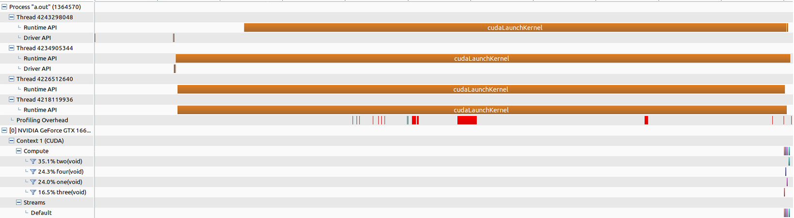

### buggy_multithread_no_gpu.cu
No gpu. Scheduling policy is set outside thread function (in `pthread_create()`). The cpu threads do not exhibit FIFO attribute.

### buggy_multithread_no_gpu.cu
Now each cpu thread call a gpu kernel so that we can profile. From profiling result it seems that the cpu threads are in parallel, and that's why threads in ***buggy_multithread_no_gpu.cu*** do not exhibit FIFO attribute.

### TODO
Set scheduling policy in thread function.
Better not use cuda synchronize function, use `sleep()` or `usleep()` instead.
