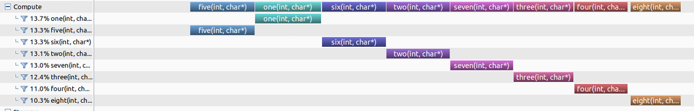

### real-kernel.cu

Each gpu kernel lauches a bubble sort, with kernel parameters.

### diff-cores.cu

Four of the thread functions are pinned to cpu 1, and the other four pinned to cpu 2.

### multi-cpu-in-set.cu

Each thread function is schedulable on both cpu 1 and cpu 2.

### TODO

- Find a cpu profiling strategy.
- Build a real-time scheduling model.
