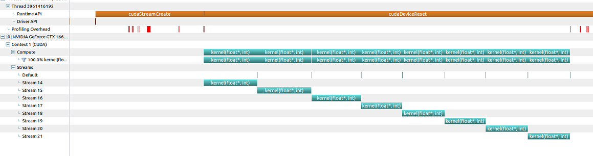
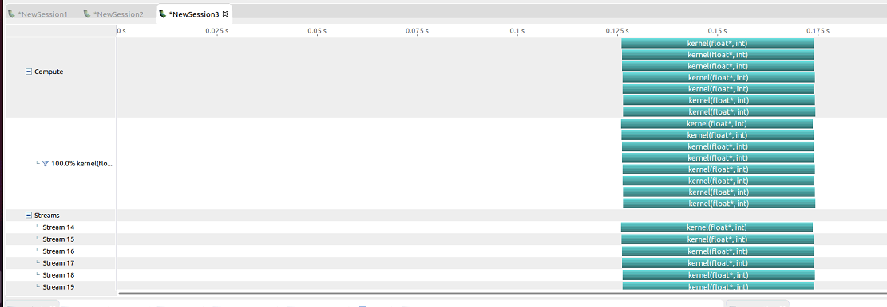

# How parallel CUDA programs block each other (Dec. 22nd)

## Current Progress

1. Creating parallel kernel functions with ``kernel<<<4,1024>>>`` cannot cause blocking situation.
2. We can do ``kernel<<<1, 64, 0, streams[i]>>>`` to run different kernel functions on different streams. Run ``blocking.cu``, we see that ``kernel<<<1, 1>>>(0, 0)`` cause different streams to block each other, so that they cannot work in parallel.



Remove the line ``kernel<<<1, 1>>>(0, 0)``, now the kernels can run in parallel.



blocking.cu
```C++
const int N = 1 << 20;

__global__ void kernel(float *x, int n)
{
    int tid = threadIdx.x + blockIdx.x * blockDim.x;
    //trivial calculation so that the kernel function has something to do
    for (int i = tid; i < n; i += blockDim.x * gridDim.x)
        x[i] = sqrt(pow(3.14159, i));
}

int main()
{
    const int num_streams = 8;
    cudaStream_t streams[num_streams];
    float *data[num_streams];
    for (int i = 0; i < num_streams; i++)
    {
        cudaStreamCreate(&streams[i]);//allocate 8 streams
        cudaMalloc(&data[i], N * sizeof(float));
        kernel<<<1, 64, 0, streams[i]>>>(data[i], N);// launch one worker kernel per stream

        kernel<<<1, 1>>>(0, 0);// launch a dummy kernel on the default stream

    }
    cudaDeviceReset();
    return 0;
}
```