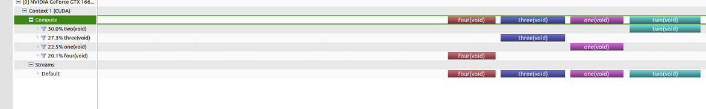
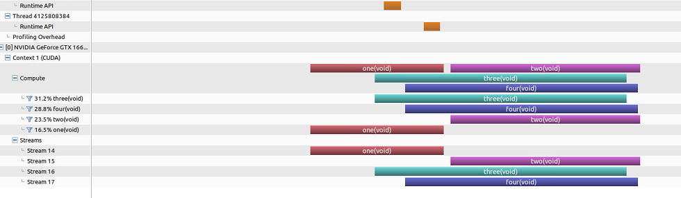

# A trial to run FIFO scheduler on CPU with pthread

## Current Progress

1. From this example, we learn how to use pthread to launch multiple CPU threads.
```C++
#include <sched.h>
#include <pthread.h>
#include <stdio.h>
#include <unistd.h>

void *call_one(void * a)
{
    cpu_set_t mask;
    CPU_ZERO(&mask);
    CPU_SET(1,&mask);
    pthread_setaffinity_np(pthread_self(), sizeof(cpu_set_t), &mask);
    printf("1\n");

    return NULL;
}

void *call_two(void *a)
{
    cpu_set_t mask;
    CPU_ZERO(&mask);
    CPU_SET(1,&mask);
    pthread_setaffinity_np(pthread_self(), sizeof(cpu_set_t), &mask);
    printf("2\n");

    return NULL;
}

void *call_three(void *a)
{
    cpu_set_t mask;
    CPU_ZERO(&mask);
    CPU_SET(1,&mask);
    pthread_setaffinity_np(pthread_self(), sizeof(cpu_set_t), &mask);
    printf("3\n");

    return NULL;
}

void *call_four(void *a)
{
    cpu_set_t mask;
    CPU_ZERO(&mask);
    CPU_SET(1,&mask);
    pthread_setaffinity_np(pthread_self(), sizeof(cpu_set_t), &mask);
    printf("4\n");

    return NULL;
}

int main() {
    cpu_set_t mask;
    CPU_ZERO(&mask);
    CPU_SET(7,&mask);

    pthread_attr_t attr;
    pthread_attr_init(&attr);

    struct sched_param param = {99};
    pthread_attr_setschedparam(&attr, &param);
    pthread_attr_setschedpolicy(&attr, SCHED_FIFO);

    pthread_t thr[4];

    /* assign pthreads so that threads launch in order*/
    /*
    pthread_create(&thr[0], &attr, call_one, &mask);
    pthread_join(thr[0],NULL);
    pthread_create(&thr[1], &attr, call_two, &mask);
    pthread_join(thr[1],NULL);
    pthread_create(&thr[2], &attr, call_three, &mask);
    pthread_join(thr[2],NULL);
    pthread_create(&thr[3], &attr, call_four, &mask);
    pthread_join(thr[3],NULL);
    */

    /* assign pthreads so that threads launch concurrently*/
    pthread_create(&thr[0], &attr, call_one, &mask);
    pthread_create(&thr[1], &attr, call_two, &mask);
    pthread_create(&thr[2], &attr, call_three, &mask);
    pthread_create(&thr[3], &attr, call_four, &mask);
    pthread_join(thr[0],NULL);
    pthread_join(thr[1],NULL);
    pthread_join(thr[2],NULL);
    pthread_join(thr[3],NULL);

    return 0;
}
```


(Possible) Output
```
1
4
2
3
```
What we see here is that ``pthread`` does not execute in order even if ``FIFO`` strategy is specified.

Note that if we use the commented out code, CPU threads will not launch concurrently.

2. We then launch GPU kernels on each thread.

```C++

#define _GNU_SOURCE
#include <sched.h>
#include <pthread.h>
#include <stdio.h>
#include <unistd.h>

__global__ void one(){
    printf("1\n");
}

void *call_one(void * a){
    cpu_set_t mask;
CPU_ZERO(&mask);
CPU_SET(1,&mask);
    pthread_setaffinity_np(pthread_self(), sizeof(cpu_set_t), &mask);
    printf("Calling 1\n");
    one<<<2,1024>>>();
    cudaThreadSynchronize();
    return NULL;
}

__global__ void two(){
    printf("2\n");
}

void *call_two(void *a){
    cpu_set_t mask;
CPU_ZERO(&mask);
CPU_SET(1,&mask);
    pthread_setaffinity_np(pthread_self(), sizeof(cpu_set_t), &mask);
    printf("Calling 2\n");
    two<<<2,1024>>>();
    cudaThreadSynchronize();
    return NULL;
}

__global__ void three(){
    printf("3\n");
}

void *call_three(void *a){
    cpu_set_t mask;
CPU_ZERO(&mask);
CPU_SET(1,&mask);
    pthread_setaffinity_np(pthread_self(), sizeof(cpu_set_t), &mask);
    printf("Calling 3\n");
    three<<<2,1024>>>();
    cudaThreadSynchronize();
    return NULL;
}

__global__ void four(){
    printf("4\n");
}

void *call_four(void *a){
    cpu_set_t mask;
CPU_ZERO(&mask);
CPU_SET(1,&mask);
    pthread_setaffinity_np(pthread_self(), sizeof(cpu_set_t), &mask);
    printf("Calling 4\n");
    four<<<2,1024>>>();
    cudaThreadSynchronize();
    return NULL;
}

int main() {
    cpu_set_t mask;
    CPU_ZERO(&mask);
    CPU_SET(7,&mask);
    // sched_setaffinity(0, sizeof(cpu_set_t), &mask);

    pthread_attr_t attr;
    pthread_attr_init(&attr);

    struct sched_param param = {99};
    pthread_attr_setschedparam(&attr, &param);
    pthread_attr_setschedpolicy(&attr, SCHED_FIFO);

    pthread_t thr[4];

    pthread_create(&thr[0], &attr, call_one, &mask);
    pthread_create(&thr[1], &attr, call_two, &mask);
    pthread_create(&thr[2], &attr, call_three, &mask);
    pthread_create(&thr[3], &attr, call_four, &mask);

    for(int i = 0; i < 4; ++i)
    {
        pthread_join(thr[i],NULL);
    }
    return 0;
}
```

(Possible) output:
```
Calling 3
Calling 1
Calling 2
Calling 4
4
4
...
3
3
...
1
1
...
2
2
...

```
The nvvp figure matches the output. Turns out that GPU kernel launching order is irrelevent to CPU thread launching order.



3. We try to adapt what we did last time, to assign GPU kernels to different streams.

```C++
#define _GNU_SOURCE
#include <sched.h>
#include <pthread.h>
#include <stdio.h>
#include <unistd.h>
const int N = 1 << 20;

struct threadData
{
    cpu_set_t mask;
    cudaStream_t stream;
};

__global__ void one(){
    printf("1\n");
}

void *call_one(void *arg){
    threadData thread_arg = (threadData)(*((threadData*)arg));
    CPU_ZERO(&(thread_arg.mask));
    CPU_SET(1,&(thread_arg.mask));
    pthread_setaffinity_np(pthread_self(), sizeof(cpu_set_t), &(thread_arg.mask));
    printf("Calling 1\n");
    one<<<1, 64, 0, thread_arg.stream>>>();
    // cudaThreadSynchronize();
    return NULL;
}
__global__ void two(){
    printf("2\n");
}

void *call_two(void *arg){
    threadData thread_arg = (threadData)(*((threadData*)arg));
    CPU_ZERO(&(thread_arg.mask));
    CPU_SET(1,&(thread_arg.mask));
    pthread_setaffinity_np(pthread_self(), sizeof(cpu_set_t), &(thread_arg.mask));
    printf("Calling 2\n");
    two<<<1, 64, 0, thread_arg.stream>>>();
    // cudaThreadSynchronize();
    return NULL;
}

__global__ void three(){
    printf("3\n");
}

void *call_three(void *arg){
    threadData thread_arg = (threadData)(*((threadData*)arg));
    CPU_ZERO(&(thread_arg.mask));
    CPU_SET(1,&(thread_arg.mask));
    pthread_setaffinity_np(pthread_self(), sizeof(cpu_set_t), &(thread_arg.mask));
    printf("Calling 3\n");
    three<<<1, 64, 0, thread_arg.stream>>>();
    // cudaThreadSynchronize();
    return NULL;
}

__global__ void four(){
    printf("4\n");
}

void *call_four(void *arg){
    threadData thread_arg = (threadData)(*((threadData*)arg));
    CPU_ZERO(&(thread_arg.mask));
    CPU_SET(1,&(thread_arg.mask));
    pthread_setaffinity_np(pthread_self(), sizeof(cpu_set_t), &(thread_arg.mask));
    printf("Calling 4\n");
    four<<<1, 64, 0, thread_arg.stream>>>();
    // cudaThreadSynchronize();
    return NULL;
}
int main() {
    cpu_set_t mask;
    CPU_ZERO(&mask);
    CPU_SET(7,&mask);
    // sched_setaffinity(0, sizeof(cpu_set_t), &mask);

    pthread_attr_t attr;
    pthread_attr_init(&attr);

    struct sched_param param = {99};
    pthread_attr_setschedparam(&attr, &param);
    pthread_attr_setschedpolicy(&attr, SCHED_FIFO);

    cudaStream_t streams[4];
    for (int i = 0; i < 4; i++)
    {
        cudaStreamCreate(&streams[i]);
    }
    pthread_t thr[4];
    threadData thData[4];
    thData[0].mask = mask;
    thData[0].stream = streams[0];
    thData[1].mask = mask;
    thData[1].stream = streams[1];
    thData[2].mask = mask;
    thData[2].stream = streams[2];
    thData[3].mask = mask;
    thData[3].stream = streams[3];

    pthread_create(&thr[0], &attr, call_one, &thData[0]);
    pthread_create(&thr[1], &attr, call_two, &thData[1]);
    pthread_create(&thr[2], &attr, call_three, &thData[2]);
    pthread_create(&thr[3], &attr, call_four, &thData[3]);

    for(int i = 0; i < 4; ++i)
    {
        pthread_join(thr[i],NULL);
    }
    cudaThreadSynchronize();
    return 0;
}
```

(Possible) output: 
```
Calling 1
Calling 3
Calling 4
Calling 2
1
1
...
3
3
...
4
4
...
2
2
...

```



The profile and the order of output differs every time the program runs. The concurrency of the GPU kernels are quite unpredictable.

One observation is that CPU threads and GPU kernels now run in the same order. (Based on 5 observations, need further proof.)
