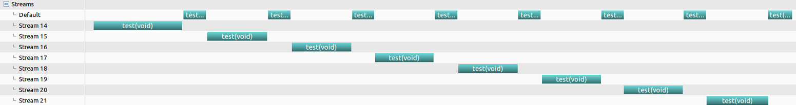
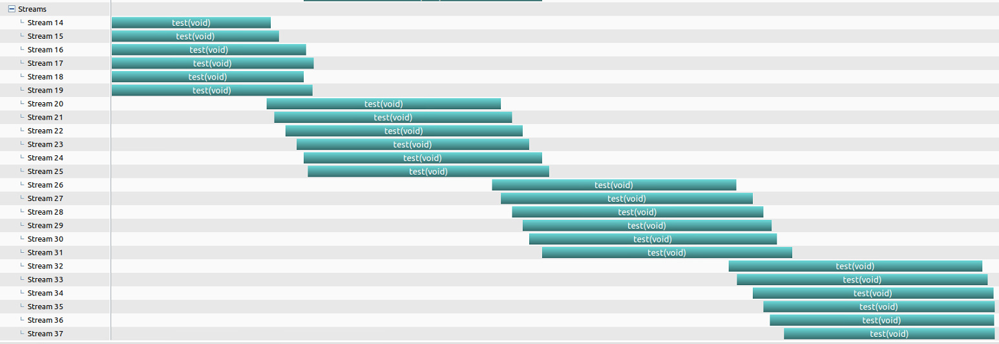

## 1
```cpp
#include <cstdio>

__global__ void test() {
  for (int i = 0; i < 4; ++i)
    printf("\n");
}

int main() {
  cudaStream_t streams[8];

  for (int i = 0; i < 8; ++i) {
    cudaStreamCreate(&streams[i]);
    test<<<1, 64, 0, streams[i]>>>();
    test<<<1, 1>>>(); // on default stream, will block specified stream
  }

  cudaDeviceReset();
  return 0;
}

```
分配在不同 stream 上的任务可由 gpu 调度实现并行，但 default stream 会 block 住 specified stream



# 2
```cpp
#include <cstdio>

__global__ void test() {
  for (int i = 0; i < 4; ++i)
    printf("\n");
}

int main() {
  cudaStream_t streams[24];

  for (int i = 0; i < 24; ++i) {
    cudaStreamCreate(&streams[i]);
    test<<<4, 1024, 0, streams[i]>>>();
  }

  cudaDeviceReset();
  return 0;
}

```
一共 24 个 stream，但 6 个 stream 上的总任务量达到了 gpu 的极限，因此每次只有 6 个 stream 在并行。


